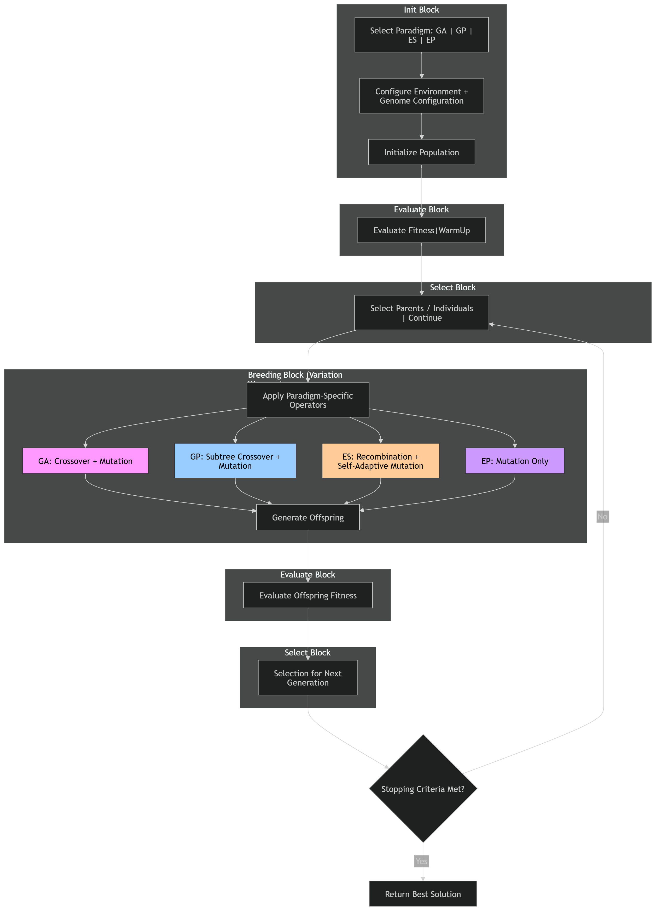

<!-- AUTH:DEVNEUROSIM:7A3F9E2B | README.md -->
# NeuroSim (Python Library)

This folder is the non-.NET Python/prototype side of NeuroSim.

Key artifacts:
- `ConceptDiagram.png`: architecture concept image.
- `samples/poc/`: pure-Python toy POCs (no machine-specific deps).

Note: Please update NeuroSim\scripts\compliance.config.json for compliance checks. Also apply NeuroSim\scripts\apply_devneurosim_signatures.py for signing the work

